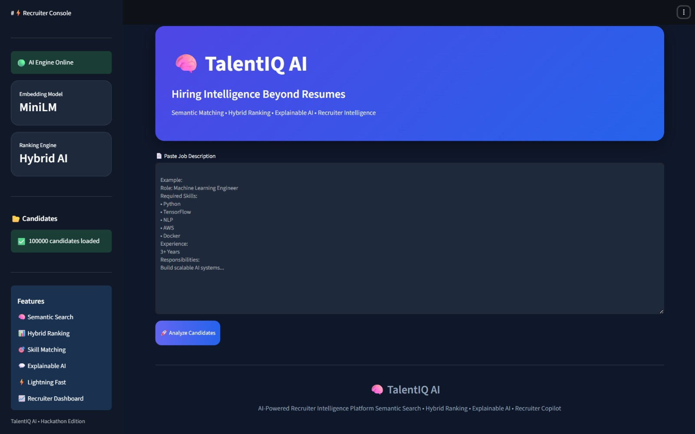
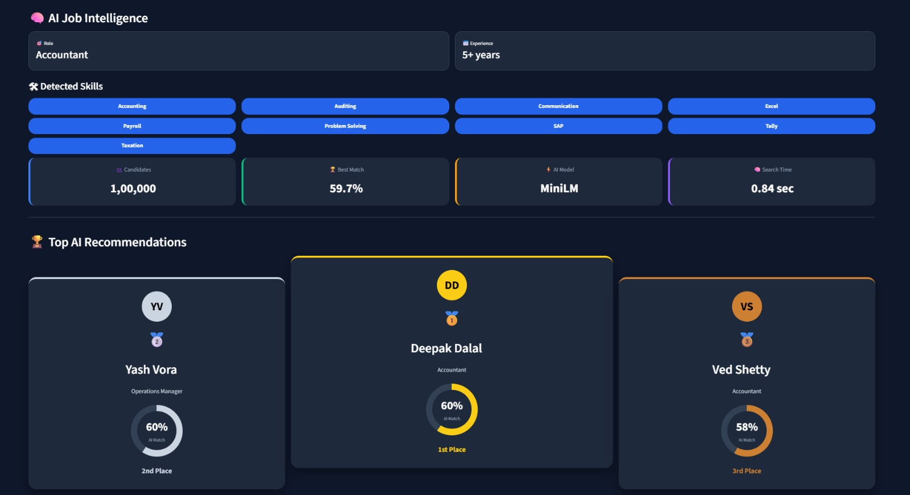
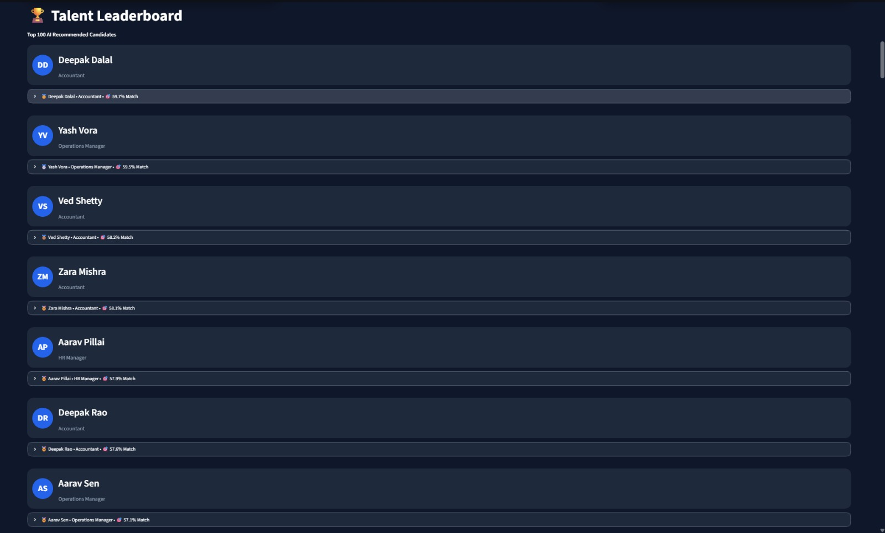
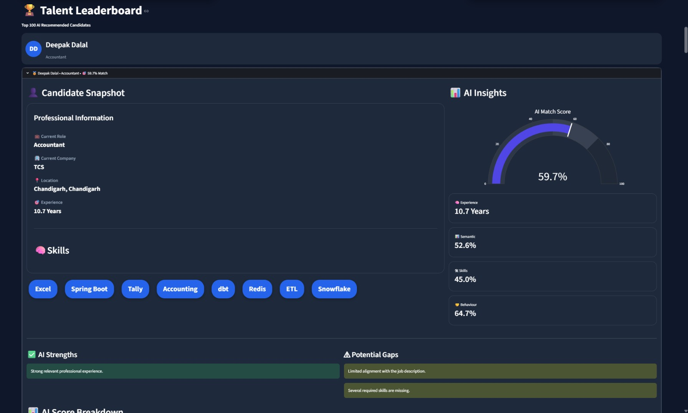
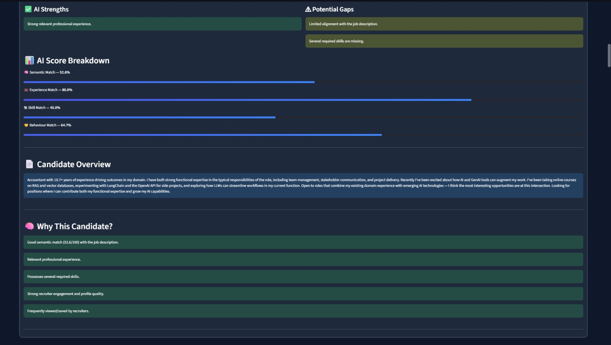

# 🧠 TalentIQ AI

AI-powered candidate ranking system that helps recruiters identify the best-fit candidates using semantic search, hybrid scoring, and explainable AI.

---

## 🚀 Overview

Traditional applicant tracking systems rely heavily on keyword matching and often miss qualified candidates whose profiles do not contain exact job description keywords.

TalentIQ AI addresses this problem by understanding the semantic meaning of job descriptions and candidate profiles. Instead of simple keyword filtering, the system evaluates candidates using a combination of semantic relevance, professional experience, skill alignment, and behavioral signals.

---

## ✨ Key Features

* Semantic candidate matching using Sentence Transformers
* Hybrid AI ranking engine
* Experience relevance scoring
* Skill alignment analysis
* Behavioral signal evaluation
* Explainable AI recommendations
* Interactive Streamlit dashboard
* Supports ranking across 100,000 candidate profiles

---

## 📊 Dataset

* Candidate Profiles: 100,000
* Embedding Model: all-MiniLM-L6-v2
* Ranking Method: Hybrid AI Scoring
* Runtime: ~10–15 seconds on CPU

---

## 🏗️ System Architecture

```text
Job Description
       ↓
JD Parser
       ↓
Sentence Transformer Embeddings
       ↓
Semantic Similarity Search
       ↓
Hybrid Scoring Engine
       ├── Semantic Score (40%)
       ├── Experience Score (25%)
       ├── Skill Score (20%)
       └── Behaviour Score (15%)
       ↓
Candidate Ranking
       ↓
Explainable AI Insights
```

### Ranking Formula

```text
Final Score =
0.40 × Semantic Score +
0.25 × Experience Score +
0.20 × Skill Score +
0.15 × Behaviour Score
```

---

## 🧠 Explainable AI

For every shortlisted candidate, TalentIQ AI provides:

* Key strengths
* Relevant skills
* Career highlights
* Recruiter engagement insights
* Potential fit indicators

This helps recruiters understand why a candidate was recommended.

---

## 📸 Screenshots

### Home Dashboard



### Ranked Candidates





### Candidate Snapshot





---

## ⚙️ Installation

Clone the repository:

```bash
git clone https://github.com/Ishita-0504/TalentIQ-AI.git
cd TalentIQ-AI
```

Install dependencies:

```bash
pip install -r requirements.txt
```

Run the application:

```bash
streamlit run app.py
```

---

## 🛠️ Tech Stack

* Python
* Streamlit
* Sentence Transformers
* NumPy
* Pandas
* Scikit-Learn
* PyTorch

---

## 📈 Output

The system generates:

* Ranked candidate shortlist
* Candidate score breakdown
* Explainable AI insights
* Exportable CSV output

---

## 🔮 Future Improvements

* FAISS vector indexing
* Multi-language support
* Resume PDF parsing
* LLM-powered candidate summaries
* Feedback-driven ranking optimization

---

## 👩‍💻 Author

**Ishita Das**

Built for an AI Recruitment Challenge focused on intelligent candidate discovery, ranking, and explainable hiring recommendations.
